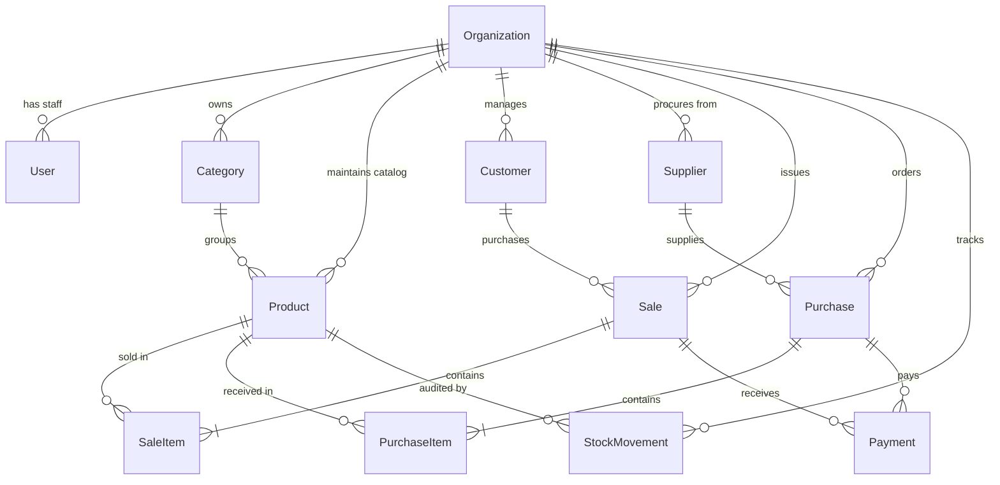

# Database Architecture & Schema Specification

> **PostgreSQL + Prisma ORM (Version 6)**  
> **Multi-Tenancy Model:** Row-Level Tenant Isolation via `organizationId`

---

## 1. Multi-Tenancy & Data Isolation Principles

1. **Shared Database, Shared Schema:** All tenants share a single PostgreSQL database instance.
2. **Mandatory Tenant Scoping:** Every business entity table includes a non-nullable `organizationId` column.
3. **Query Guardrail:** All Prisma data access queries are scoped by the authenticated user's `organizationId`:
   ```typescript
   prisma.product.findMany({
     where: { organizationId: user.organizationId, status: 'ACTIVE' },
   });
   ```
4. **Cascade Rules:** Deleting an organization cascades to its operational data (categories, products, sales, customers), preserving relational hygiene.

---

## 2. Entity-Relationship Diagram (ERD)



---

## 3. Detailed Data Models

### 3.1 Core Authentication & Organization

#### `User`

Stores staff and business owner credentials with role-based access.

| Column                       | Type              | Constraints           | Description                             |
| ---------------------------- | ----------------- | --------------------- | --------------------------------------- |
| `id`                         | `String`          | Primary Key, `cuid()` | Unique user ID                          |
| `email`                      | `String`          | Unique, Not Null      | User login email                        |
| `fullName`                   | `String`          | Not Null              | User's full name                        |
| `mobile`                     | `String`          | Not Null              | Contact mobile number                   |
| `passwordHash`               | `String`          | Not Null              | Argon2 hashed password                  |
| `role`                       | `Enum (UserRole)` | Default: `OWNER`      | `OWNER`, `ADMIN`, `STAFF`               |
| `isEmailVerified`            | `Boolean`         | Default: `false`      | Email verification flag                 |
| `emailVerificationTokenHash` | `String?`         | Nullable              | Token hash for email OTP/verification   |
| `emailVerificationExpiresAt` | `DateTime?`       | Nullable              | Token expiry timestamp                  |
| `passwordResetTokenHash`     | `String?`         | Nullable              | Token hash for password reset           |
| `passwordResetExpiresAt`     | `DateTime?`       | Nullable              | Password reset expiry timestamp         |
| `refreshTokenHash`           | `String?`         | Nullable              | Hashed refresh token for cookie session |
| `refreshTokenExpiresAt`      | `DateTime?`       | Nullable              | Refresh token expiry timestamp          |
| `onboardingCompletedAt`      | `DateTime?`       | Nullable              | Timestamp when onboarding was finished  |
| `organizationId`             | `String?`         | Unique, Foreign Key   | Refers to `Organization(id)`            |
| `createdAt` / `updatedAt`    | `DateTime`        | Automatic             | Timestamps                              |

#### `Organization`

Stores tenant business settings, branding, GST/tax, and locale.

| Column                                      | Type                        | Constraints               | Description                                      |
| ------------------------------------------- | --------------------------- | ------------------------- | ------------------------------------------------ |
| `id`                                        | `String`                    | Primary Key, `cuid()`     | Unique organization/tenant ID                    |
| `businessName`                              | `String`                    | Not Null                  | Legal business / store name                      |
| `businessType`                              | `String`                    | Not Null                  | e.g. "Retail", "EV Sales & Service", "Wholesale" |
| `ownerName`                                 | `String`                    | Not Null                  | Primary owner contact name                       |
| `mobile`                                    | `String`                    | Not Null                  | Business phone number                            |
| `gst`                                       | `String?`                   | Nullable                  | GSTIN / Tax Identification Number                |
| `addressLine1`                              | `String?`                   | Nullable                  | Street address line 1                            |
| `addressLine2`                              | `String?`                   | Nullable                  | Street address line 2                            |
| `city` / `state` / `postalCode` / `country` | `String?`                   | Nullable                  | Geolocation details                              |
| `currencyCode`                              | `String?`                   | Default: `"INR"`          | Currency (INR, USD, EUR, etc.)                   |
| `timezone`                                  | `String?`                   | Default: `"Asia/Kolkata"` | Operating timezone                               |
| `financialYearStartMonth`                   | `Int?`                      | Default: `4`              | 4 = April (standard Indian FY)                   |
| `logoUrl`                                   | `String?`                   | Nullable                  | Business logo path/URL                           |
| `status`                                    | `Enum (OrganizationStatus)` | Default: `DRAFT`          | `DRAFT`, `ACTIVE`                                |
| `createdAt` / `updatedAt`                   | `DateTime`                  | Automatic                 | Timestamps                                       |

---

### 3.2 Catalog & Inventory

#### `Category`

Groups products and services for navigation and reporting.

| Column                    | Type       | Constraints           | Description                                                          |
| ------------------------- | ---------- | --------------------- | -------------------------------------------------------------------- |
| `id`                      | `String`   | Primary Key, `cuid()` | Unique category ID                                                   |
| `organizationId`          | `String`   | Foreign Key, Not Null | Organization tenant ID                                               |
| `name`                    | `String`   | Not Null              | Category name (e.g., "EV Scooters", "Brake Spares", "Labor Charges") |
| `status`                  | `String`   | Default: `"ACTIVE"`   | `"ACTIVE"`, `"INACTIVE"`                                             |
| `createdAt` / `updatedAt` | `DateTime` | Automatic             | Timestamps                                                           |

#### `Product`

Master catalog items — both physical products (with stock) and non-inventory services/labor.

| Column                    | Type            | Constraints           | Description                                                             |
| ------------------------- | --------------- | --------------------- | ----------------------------------------------------------------------- |
| `id`                      | `String`        | Primary Key, `cuid()` | Unique product ID                                                       |
| `organizationId`          | `String`        | Foreign Key, Not Null | Organization tenant ID                                                  |
| `name`                    | `String`        | Not Null              | Product/Service title                                                   |
| `sku`                     | `String`        | Not Null              | Unique stock keeping unit per org (`[organizationId, sku]`)             |
| `barcode`                 | `String?`       | Nullable              | Barcode / EAN / QR code value                                           |
| `category`                | `String`        | Not Null              | Category name                                                           |
| `categoryId`              | `String?`       | Foreign Key, Nullable | Refers to `Category(id)`                                                |
| `sellingPrice`            | `Decimal(12,2)` | Not Null              | Customer selling price                                                  |
| `costPrice`               | `Decimal(12,2)` | Default: `0.00`       | Supplier purchase cost                                                  |
| `isService`               | `Boolean`       | Default: `false`      | `true` = Service/Labor (no stock deduction); `false` = Physical product |
| `currentStock`            | `Int`           | Default: `0`          | Physical units on hand                                                  |
| `reorderLevel`            | `Int`           | Default: `0`          | Threshold to trigger low-stock alerts                                   |
| `unitType`                | `String`        | Default: `"PCS"`      | Unit: `"PCS"`, `"SET"`, `"LITRE"`, `"HR"`, etc.                         |
| `taxRate`                 | `Decimal(5,2)`  | Default: `0.00`       | Applicable GST / Tax percentage (e.g. 18.00%)                           |
| `status`                  | `String`        | Default: `"ACTIVE"`   | `"ACTIVE"`, `"INACTIVE"`, `"ARCHIVED"`                                  |
| `createdAt` / `updatedAt` | `DateTime`      | Automatic             | Timestamps                                                              |

#### `StockMovement` (Inventory Audit Log)

Tracks every increment, decrement, and manual correction of inventory.

| Column           | Type                       | Constraints           | Description                                                 |
| ---------------- | -------------------------- | --------------------- | ----------------------------------------------------------- |
| `id`             | `String`                   | Primary Key, `cuid()` | Unique audit record ID                                      |
| `organizationId` | `String`                   | Foreign Key, Not Null | Organization tenant ID                                      |
| `productId`      | `String`                   | Foreign Key, Not Null | Refers to `Product(id)`                                     |
| `type`           | `Enum (StockMovementType)` | Not Null              | `SALE`, `PURCHASE`, `ADJUSTMENT`, `RETURN`, `DAMAGE`        |
| `quantityDelta`  | `Int`                      | Not Null              | e.g. `-2` for sale, `+10` for purchase, `+5` for adjustment |
| `previousStock`  | `Int`                      | Not Null              | Stock level before movement                                 |
| `newStock`       | `Int`                      | Not Null              | Stock level after movement                                  |
| `referenceId`    | `String?`                  | Nullable              | Linked `saleId` or `purchaseId`                             |
| `reason`         | `String?`                  | Nullable              | Optional notes (e.g. "Physical stock audit discrepancy")    |
| `createdAt`      | `DateTime`                 | Automatic             | Timestamp of movement                                       |

---

### 3.3 Customers & Suppliers (CRM & Vendor Management)

#### `Customer`

Customer profiles, vehicle records, and accounts receivable balance.

| Column                    | Type            | Constraints           | Description                                                            |
| ------------------------- | --------------- | --------------------- | ---------------------------------------------------------------------- |
| `id`                      | `String`        | Primary Key, `cuid()` | Unique customer ID                                                     |
| `organizationId`          | `String`        | Foreign Key, Not Null | Organization tenant ID                                                 |
| `name`                    | `String`        | Not Null              | Customer full name                                                     |
| `mobile`                  | `String`        | Not Null              | Mobile number                                                          |
| `email`                   | `String?`       | Nullable              | Email address                                                          |
| `gst`                     | `String?`       | Nullable              | Customer GSTIN for B2B billing                                         |
| `address`                 | `String?`       | Nullable              | Billing / shipping address                                             |
| `vehicleDetails`          | `String?`       | Nullable              | Vehicle Model & Registration No. (e.g. _"Ather 450X - DL-05-EF-9876"_) |
| `outstandingBalance`      | `Decimal(12,2)` | Default: `0.00`       | Unpaid dues balance                                                    |
| `createdAt` / `updatedAt` | `DateTime`      | Automatic             | Timestamps                                                             |

#### `Supplier`

Vendor directory for purchase orders and accounts payable balance.

| Column                    | Type            | Constraints           | Description                       |
| ------------------------- | --------------- | --------------------- | --------------------------------- |
| `id`                      | `String`        | Primary Key, `cuid()` | Unique supplier ID                |
| `organizationId`          | `String`        | Foreign Key, Not Null | Organization tenant ID            |
| `name`                    | `String`        | Not Null              | Company or supplier name          |
| `contactPerson`           | `String?`       | Nullable              | Primary contact representative    |
| `mobile`                  | `String`        | Not Null              | Phone number                      |
| `email`                   | `String?`       | Nullable              | Email address                     |
| `gst`                     | `String?`       | Nullable              | Supplier GSTIN                    |
| `address`                 | `String?`       | Nullable              | Supplier office/warehouse address |
| `outstandingBalance`      | `Decimal(12,2)` | Default: `0.00`       | Amount owed to supplier           |
| `createdAt` / `updatedAt` | `DateTime`      | Automatic             | Timestamps                        |

---

### 3.4 Sales, Invoicing & POS

#### `Sale`

Sales transactions, POS checkouts, quotations, and tax invoices.

| Column                    | Type                | Constraints           | Description                                        |
| ------------------------- | ------------------- | --------------------- | -------------------------------------------------- |
| `id`                      | `String`            | Primary Key, `cuid()` | Unique sale ID                                     |
| `organizationId`          | `String`            | Foreign Key, Not Null | Organization tenant ID                             |
| `saleNumber`              | `String`            | Not Null              | Sequential invoice number (e.g. `INV-2026-0001`)   |
| `type`                    | `Enum (SaleType)`   | Default: `INVOICE`    | `INVOICE`, `QUOTATION`, `ORDER`                    |
| `customerId`              | `String?`           | Foreign Key, Nullable | Refers to `Customer(id)`                           |
| `subtotal`                | `Decimal(12,2)`     | Not Null              | Sum of items before discount & tax                 |
| `discount`                | `Decimal(12,2)`     | Default: `0.00`       | Discount applied                                   |
| `tax`                     | `Decimal(12,2)`     | Default: `0.00`       | Total GST / Tax calculated                         |
| `grandTotal`              | `Decimal(12,2)`     | Not Null              | Final amount payable                               |
| `paidAmount`              | `Decimal(12,2)`     | Default: `0.00`       | Total received from customer                       |
| `status`                  | `Enum (SaleStatus)` | Default: `COMPLETED`  | `DRAFT`, `COMPLETED`, `CANCELLED`                  |
| `paymentMethod`           | `String`            | Default: `"CASH"`     | `"CASH"`, `"UPI"`, `"CARD"`, `"CREDIT"`, `"SPLIT"` |
| `vehicleNotes`            | `String?`           | Nullable              | Vehicle reg. number, odometer, or repair notes     |
| `createdAt` / `updatedAt` | `DateTime`          | Automatic             | Timestamps                                         |

#### `SaleItem`

Line items belonging to a sale.

| Column         | Type            | Constraints           | Description                                |
| -------------- | --------------- | --------------------- | ------------------------------------------ |
| `id`           | `String`        | Primary Key, `cuid()` | Unique sale item ID                        |
| `saleId`       | `String`        | Foreign Key, Not Null | Refers to `Sale(id)` on delete cascade     |
| `productId`    | `String`        | Foreign Key, Not Null | Refers to `Product(id)` on delete restrict |
| `productName`  | `String`        | Not Null              | Snapshot of product title at time of sale  |
| `quantity`     | `Int`           | Not Null              | Number of units sold                       |
| `sellingPrice` | `Decimal(12,2)` | Not Null              | Price per unit at time of sale             |
| `discount`     | `Decimal(12,2)` | Default: `0.00`       | Line item discount                         |
| `subtotal`     | `Decimal(12,2)` | Not Null              | `(quantity * sellingPrice) - discount`     |

---

### 3.5 Procurement & Purchases

#### `Purchase`

Purchase orders from suppliers and goods received tracking.

| Column                    | Type                    | Constraints           | Description                          |
| ------------------------- | ----------------------- | --------------------- | ------------------------------------ |
| `id`                      | `String`                | Primary Key, `cuid()` | Unique purchase ID                   |
| `organizationId`          | `String`                | Foreign Key, Not Null | Organization tenant ID               |
| `purchaseNumber`          | `String`                | Not Null              | PO number (e.g. `PO-2026-0012`)      |
| `supplierId`              | `String`                | Foreign Key, Not Null | Refers to `Supplier(id)`             |
| `supplierInvoiceRef`      | `String?`               | Nullable              | Supplier's tax bill reference number |
| `status`                  | `Enum (PurchaseStatus)` | Default: `RECEIVED`   | `ORDERED`, `RECEIVED`, `CANCELLED`   |
| `subtotal`                | `Decimal(12,2)`         | Not Null              | Sum of items before tax              |
| `tax`                     | `Decimal(12,2)`         | Default: `0.00`       | Tax amount                           |
| `grandTotal`              | `Decimal(12,2)`         | Not Null              | Final payable to supplier            |
| `paidAmount`              | `Decimal(12,2)`         | Default: `0.00`       | Amount paid to supplier              |
| `notes`                   | `String?`               | Nullable              | Procurement notes                    |
| `createdAt` / `updatedAt` | `DateTime`              | Automatic             | Timestamps                           |

#### `PurchaseItem`

Line items belonging to a purchase order.

| Column       | Type            | Constraints           | Description                                |
| ------------ | --------------- | --------------------- | ------------------------------------------ |
| `id`         | `String`        | Primary Key, `cuid()` | Unique purchase item ID                    |
| `purchaseId` | `String`        | Foreign Key, Not Null | Refers to `Purchase(id)` on delete cascade |
| `productId`  | `String`        | Foreign Key, Not Null | Refers to `Product(id)` on delete restrict |
| `quantity`   | `Int`           | Not Null              | Units received                             |
| `unitCost`   | `Decimal(12,2)` | Not Null              | Cost price per unit from supplier          |
| `subtotal`   | `Decimal(12,2)` | Not Null              | `quantity * unitCost`                      |

---

## 4. Indexing & Query Optimization Strategy

1. **Unique Constraints:**
   - `Product`: `@@unique([organizationId, sku])`
   - `Sale`: `@@unique([organizationId, saleNumber])`
   - `Purchase`: `@@unique([organizationId, purchaseNumber])`
2. **Lookup Indexes for High-Traffic Queries:**
   - `Sale`: `@@index([organizationId, createdAt])`, `@@index([organizationId, status])`
   - `Product`: `@@index([organizationId, status])`, `@@index([organizationId, category])`
   - `StockMovement`: `@@index([organizationId, productId, createdAt])`
   - `Customer`: `@@index([organizationId, mobile])`
   - `Supplier`: `@@index([organizationId, mobile])`
